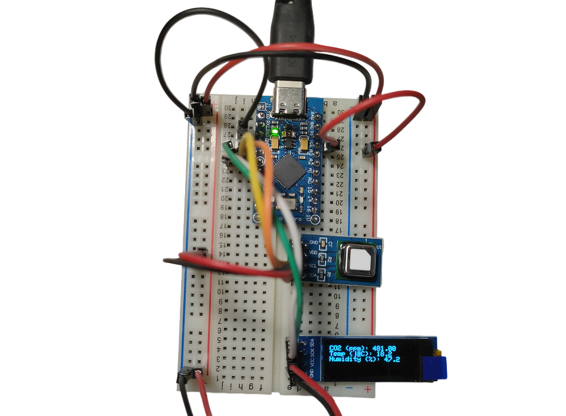

# Arduino-Based CO2, Temperature, and Humidity Monitoring System with OLED Display

This project monitors CO2 levels, temperature, and humidity using the **SCD4x** sensor and presents the data on an **SSD1306 OLED display** in real time.



## Hardware Requirements

- **Arduino Board** (e.g., Arduino Leonardo, Arduino Micro or similar with ATmega32U4 Processor)
- **SCD4x Sensor** (SCD41/SCD40)
- **SSD1306 0.91inch OLED Display Module** (128x32 pixels, I2C interface)
- **Jumper Wires**

## Pinout Details

### SCD4x Sensor Pinout

| Pin   | Connection     |
|-------|----------------|
| VCC   | 5V             |
| GND   | GND            |
| SDA   | Pin 2          |
| SCL   | Pin 3          |

### SSD1306 OLED Display Pinout

| Pin   | Connection     |
|-------|----------------|
| VCC   | 5V             |
| GND   | GND            |
| SDA   | Pin 2          |
| SCL   | Pin 3          |

**Note:** Both the SSD1306 OLED and the SCD4x sensor communicate over I2C, so they share the SDA and SCL lines.

## Libraries Required

These libraries can be installed via the Arduino Library Manager:

- **Adafruit GFX** - Graphics library for the OLED display.
- **Adafruit SSD1306** - OLED display driver.
- **SparkFun SCD4x Arduino Library** - For reading data from the SCD4x sensor.

## Software Setup

1. Open the Arduino IDE.
2. Go to **Sketch > Include Library > Manage Libraries**.
3. Install the required libraries (Adafruit GFX, Adafruit SSD1306, and SparkFun SCD4x).
4. Connect the hardware according to the pinout.
5. Upload the code to your Arduino.

## Example Output (on Serial Monitor)

```
CO2 (ppm): 413.00    Temperature (°C): 22.3    Humidity (%RH): 55.6
CO2 (ppm): 420.00    Temperature (°C): 22.3    Humidity (%RH): 55.4
CO2 (ppm): 425.00    Temperature (°C): 22.3    Humidity (%RH): 55.3
```

### Example Display Output

```
CO2 (ppm): 413.00
Temp (°C): 22.3
Humidity (%): 55.6
```

## License

This project is licensed under the MIT License. See the [LICENSE](LICENSE) file for details.
